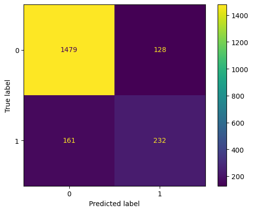
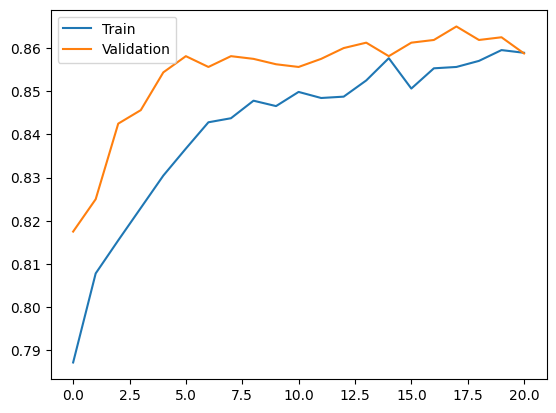
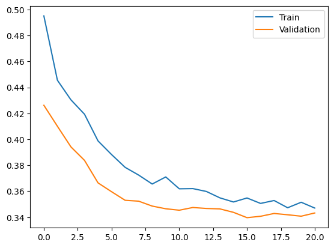

# Customer Churn Prediction Using Neural Networks and TensorFlow

A multi-layer Artificial Neural Network (ANN) built with TensorFlow/Keras that predicts whether a bank customer will churn, trained on the Bank Customer Churn (Churn_Modelling) dataset.

## Overview

Customer churn — the loss of clients to competitors — is a critical business problem in banking. Retaining existing customers is far more cost-effective than acquiring new ones. This project trains a deep learning classifier on customer demographic and account features to identify at-risk customers before they leave, giving banks the opportunity to intervene proactively.

## Model Architecture

```
Input → Dense(64, ReLU) → Dropout(0.3) → Dense(32, ReLU) → Dropout(0.2) → Dense(16, ReLU) → Dropout(0.1) → Dense(1, Sigmoid)
```

| Layer | Units / Rate | Activation |
|---|---|---|
| Hidden Layer 1 (Dense) | 64 Neurons | ReLU |
| Dropout 1 | Rate = 0.3 | — |
| Hidden Layer 2 (Dense) | 32 Neurons | ReLU |
| Dropout 2 | Rate = 0.2 | — |
| Hidden Layer 3 (Dense) | 16 Neurons | ReLU |
| Dropout 3 | Rate = 0.1 | — |
| Output Layer (Dense) | 1 Neuron | Sigmoid |

The decreasing Dropout schedule (0.3 → 0.2 → 0.1) applies stronger regularization to wider early layers where overfitting risk is highest, and lighter regularization near the output.

### Training Configuration

| Parameter | Value |
|---|---|
| Optimizer | Adam |
| Loss Function | Binary Crossentropy |
| Epochs | Up to 50 (Early Stopping) |
| Batch Size | 32 |
| Validation Split | 20% |
| Early Stopping | monitor=val_loss, patience=5, restore_best_weights=True |
| Prediction Threshold | 0.35 (tuned to improve churn recall) |

Training converged at approximately epoch 20 due to Early Stopping.

## Dataset

**File:** `Churn_Modelling.csv` — 10,000 bank customer records.

### Features Used After Preprocessing

| Feature | Type | Description |
|---|---|---|
| CreditScore | Numerical | Customer's credit score |
| Gender | Encoded | Male / Female → 0 / 1 (LabelEncoder) |
| Age | Numerical | Age of the customer |
| Tenure | Numerical | Years as a bank customer |
| Balance | Numerical | Account balance |
| NumOfProducts | Numerical | Number of bank products used |
| HasCrCard | Numerical | Has credit card (0 or 1) |
| IsActiveMember | Numerical | Is an active member (0 or 1) |
| EstimatedSalary | Numerical | Estimated annual salary |
| Geography_Germany | One-Hot | Customer from Germany |
| Geography_Spain | One-Hot | Customer from Spain |
| **Exited (Target)** | Binary | **0 = Stayed, 1 = Churned** |

### Dropped Columns

`RowNumber`, `CustomerId`, `Surname` — non-informative identifiers.

### Class Distribution

| Class | Count | Percentage |
|---|---|---|
| 0 — Stayed | ~7,963 | ~79.6% |
| 1 — Churned | ~2,037 | ~20.4% |

The dataset is imbalanced. A prediction threshold of **0.35** (instead of the default 0.50) is applied at inference to improve recall for the minority churn class.

## Preprocessing Pipeline

1. **Drop** non-informative columns (`RowNumber`, `CustomerId`, `Surname`)
2. **Label encode** `Gender` → binary 0/1
3. **One-hot encode** `Geography` with `drop_first=True` (France as baseline)
4. **Train-test split** — 80% train / 20% test (`random_state=42`)
5. **StandardScaler** — fit on training set, transform both sets (no data leakage)

## Results

**Test Accuracy: 86%** on 2,000 held-out samples

### Classification Report

| Class | Precision | Recall | F1-Score | Support |
|---|---|---|---|---|
| 0 (Stayed) | 0.90 | 0.92 | 0.91 | 1,607 |
| 1 (Churned) | 0.64 | 0.59 | 0.62 | 393 |
| **Accuracy** | | | **0.86** | 2,000 |
| Macro Avg | 0.77 | 0.76 | 0.76 | 2,000 |
| Weighted Avg | 0.85 | 0.86 | 0.85 | 2,000 |

### Confusion Matrix

| | Predicted: Stay | Predicted: Churn |
|---|---|---|
| **Actual: Stay** | 1,479 (TN) | 128 (FP) |
| **Actual: Churn** | 161 (FN) | 232 (TP) |



### Training Curves

| Accuracy | Loss |
|---|---|
|  |  |

Both curves converge stably by ~epoch 20. Validation accuracy briefly exceeds training accuracy in early epochs — expected behavior with Dropout active only during training.

## Project Structure

```
.
├── data/
│   └── Churn_Modelling.csv             # Raw dataset
├── models/
│   └── heart_model.keras               # Saved trained model
├── churn_prediction.ipynb              # Main notebook
├── confusion_matrix.png                # Test set confusion matrix
├── accuracy_curve.png                  # Train/validation accuracy plot
├── loss_curve.png                      # Train/validation loss plot
├── Customer_Churn_Prediction_Report.pdf
└── README.md
```

## Tools and Technologies

- Python
- TensorFlow / Keras
- Scikit-Learn
- Pandas
- NumPy
- Matplotlib
- Jupyter Notebook

## Future Improvements

- Apply class weighting or SMOTE oversampling to address class imbalance
- Further threshold optimization using Precision-Recall curves
- Hyperparameter tuning (learning rate, layer widths, batch size)
- Explore ensemble methods (Random Forest, XGBoost) as baselines
- Add Batch Normalization for faster and more stable convergence
- Cross-validation for more robust performance estimation

## References

- [TensorFlow Documentation](https://www.tensorflow.org/)
- [Keras Documentation](https://keras.io/)
- [Scikit-Learn Documentation](https://scikit-learn.org/)
- [Churn Modelling Dataset — Kaggle](https://www.kaggle.com/datasets/shubh0799/churn-modelling)
- [Pandas Documentation](https://pandas.pydata.org/)
