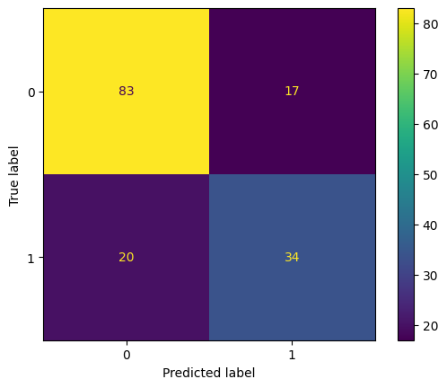
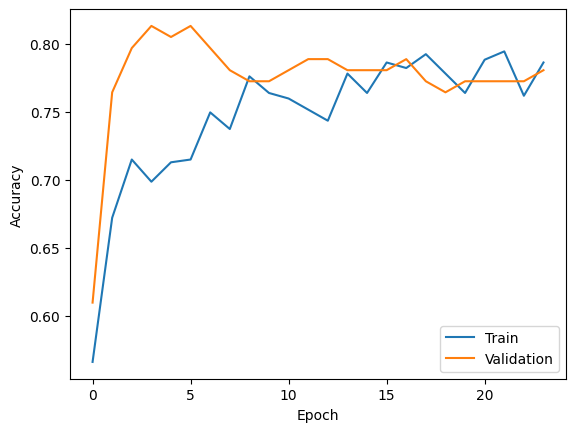
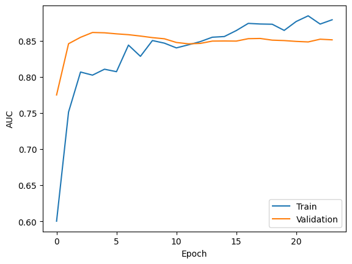
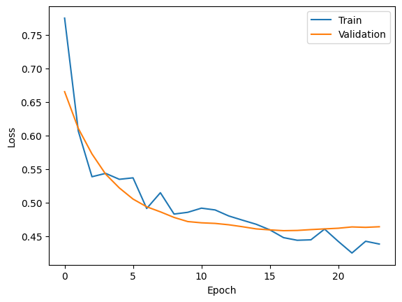

# Diabetes Prediction Using Neural Networks and TensorFlow

A multi-layer Artificial Neural Network (ANN) built with TensorFlow/Keras that predicts the presence of diabetes in patients, trained on the Pima Indians Diabetes Dataset. The model incorporates BatchNormalization, Dropout regularization, class weighting, and adaptive training callbacks for stable, robust training.

## Overview

Diabetes mellitus is one of the most prevalent chronic diseases globally, with Type 2 diabetes being largely preventable through early detection. This project trains a deep learning binary classifier on eight clinical diagnostic measurements to identify high-risk patients before symptoms fully develop.

**Key highlights:**
- BatchNormalization after every hidden layer for stable gradient flow
- Dropout regularization to reduce overfitting
- `compute_class_weight('balanced')` to handle class imbalance
- `ReduceLROnPlateau` for adaptive learning rate scheduling
- `EarlyStopping` with `restore_best_weights=True` — training halted at ~epoch 24
- Custom prediction threshold of **0.55** to reduce false positives
- AUC tracked as a primary metric alongside accuracy

## Model Architecture

```
Input (8 features)
  → Dense(64, ReLU) → BatchNormalization → Dropout(0.2)
  → Dense(32, ReLU) → BatchNormalization → Dropout(0.2)
  → Dense(16, ReLU) → BatchNormalization
  → Dense(1, Sigmoid)
```

| Layer | Units / Rate | Notes |
|---|---|---|
| Hidden Layer 1 (Dense) | 64 Neurons, ReLU | — |
| BatchNormalization 1 | — | Normalizes activations |
| Dropout 1 | Rate = 0.2 | — |
| Hidden Layer 2 (Dense) | 32 Neurons, ReLU | — |
| BatchNormalization 2 | — | Normalizes activations |
| Dropout 2 | Rate = 0.2 | — |
| Hidden Layer 3 (Dense) | 16 Neurons, ReLU | — |
| BatchNormalization 3 | — | Normalizes activations |
| Output Layer (Dense) | 1 Neuron | Sigmoid activation |

### Training Configuration

| Parameter | Value |
|---|---|
| Optimizer | Adam (lr=0.001) |
| Loss Function | Binary Crossentropy |
| Metrics | Accuracy, AUC, Precision, Recall |
| Epochs | Up to 100 (EarlyStopping at ~24) |
| Batch Size | 32 |
| Class Weighting | `compute_class_weight('balanced')` |
| Prediction Threshold | 0.55 |

### Callbacks

| Callback | Configuration | Purpose |
|---|---|---|
| EarlyStopping | monitor=val_loss, patience=10, restore_best_weights=True | Stops when val_loss stalls; restores best weights |
| ReduceLROnPlateau | monitor=val_loss, factor=0.5, patience=5, min_lr=1e-6 | Halves LR every 5 epochs without improvement |
| ModelCheckpoint | monitor=val_loss, save_best_only=True | Saves best model to disk |

## Dataset

**File:** `diabetes.csv` — Pima Indians Diabetes Dataset (UCI / Kaggle)

768 records, 8 numeric features, 1 binary target. All patients are female, aged 21+.

### Features

| Feature | Description |
|---|---|
| Pregnancies | Number of times pregnant |
| Glucose | Plasma glucose concentration (2-hour OGTT) |
| BloodPressure | Diastolic blood pressure (mm Hg) |
| SkinThickness | Triceps skinfold thickness (mm) |
| Insulin | 2-hour serum insulin (mu U/ml) |
| BMI | Body mass index (weight/height²) |
| DiabetesPedigreeFunction | Genetic diabetes risk score |
| Age | Age of the patient (years) |
| **Outcome (Target)** | **0 = No Diabetes, 1 = Diabetes** |

### Class Distribution

| Class | Count | Percentage |
|---|---|---|
| 0 — No Diabetes | 500 | 65.1% |
| 1 — Diabetes | 268 | 34.9% |

> ⚠️ Note: Zero values in Glucose, BloodPressure, SkinThickness, Insulin, and BMI are biologically impossible and represent missing data encoded as zeros. This is a known data quality issue that impacts model performance. See [Known Limitations](#known-limitations--why-the-model-plateaus) below.

## Preprocessing Pipeline

1. **Load** `diabetes.csv` with Pandas
2. **Separate** features (`X`) and target (`y = Outcome`)
3. **Stratified train/test split** — 80% train+val / 20% test (`stratify=y`, `random_state=42`)
4. **Stratified train/val split** — 80% train / 20% val from training portion
5. **StandardScaler** — fit on `X_train` only, transform `X_val` and `X_test` (no data leakage)
6. **Class weighting** — `compute_class_weight('balanced')` → passed to `model.fit()`

### Data Splits

| Split | Size | Percentage |
|---|---|---|
| Training | ~490 samples | ~64% |
| Validation | ~124 samples | ~16% |
| Test | 154 samples | 20% |

## Results

**Test Accuracy: 76%** &nbsp;|&nbsp; **AUC: 0.8244** &nbsp;|&nbsp; **Loss: 0.4971**

### Classification Report

| Class | Precision | Recall | F1-Score | Support |
|---|---|---|---|---|
| 0 (No Diabetes) | 0.81 | 0.83 | 0.82 | 100 |
| 1 (Diabetes) | 0.67 | 0.63 | 0.65 | 54 |
| **Accuracy** | | | **0.76** | 154 |
| Macro Avg | 0.74 | 0.73 | 0.73 | 154 |
| Weighted Avg | 0.76 | 0.76 | 0.76 | 154 |

### Confusion Matrix

| | Predicted: No Diabetes | Predicted: Diabetes |
|---|---|---|
| **Actual: No Diabetes** | 83 (TN) | 17 (FP) |
| **Actual: Diabetes** | 20 (FN) | 34 (TP) |



### Training Curves

| Accuracy | AUC |
|---|---|
|  |  |



All curves converge stably by ~epoch 24. Validation metrics closely track training metrics, confirming the regularization stack is working effectively with minimal overfitting.

## Known Limitations — Why the Model Plateaus

Despite a well-regularized architecture and multiple callbacks, the model plateaus at ~76% accuracy. These are the primary root causes:

1. **Small dataset (~768 rows)** — After splitting, the model trains on only ~490 samples. Neural networks need far more data to learn robust patterns; traditional ML models (XGBoost, Random Forest) are often better suited to datasets this size.

2. **Zero-encoded missing values** — Columns like Glucose, BloodPressure, SkinThickness, Insulin, and BMI contain zeros that are biologically impossible. These are missing values masquerading as real data, directly degrading training quality. *Fix: impute zeros with column medians or KNN imputation.*

3. **Class imbalance (65% vs 35%)** — Class weighting helps but the distribution disparity still causes the model to perform significantly better on the majority class (F1=0.82 vs F1=0.65). *Fix: combine class weighting with SMOTE oversampling.*

4. **Over-parameterized architecture** — A 64→32→16 network has many parameters relative to ~490 training samples. *Fix: try a simpler Dense(32)→Dense(16) architecture with L2 regularization.*

5. **No feature engineering** — All 8 features are raw measurements. Interaction terms (BMI×Age, Glucose/Insulin ratio) could expose non-linear relationships the network cannot discover from raw inputs alone.

## Future Improvements

- **Fix missing data** — Replace impossible zeros with median or KNN imputation (+2–4% accuracy expected)
- **SMOTE oversampling** — Synthetically balance the training set minority class
- **Threshold optimization** — Use Precision-Recall curves to find the optimal threshold for clinical use (prioritize recall for diabetes detection)
- **Try ML baselines** — XGBoost, LightGBM, or Random Forest as benchmarks
- **Feature engineering** — BMI×Age, Glucose/Insulin ratio, polynomial features
- **Cross-validation** — Stratified K-Fold CV for more reliable performance estimation
- **Hyperparameter tuning** — Keras Tuner or Optuna for systematic search

## Project Structure

```
Diabetes_Prediction/
├── data/
│   └── diabetes.csv                    # Pima Indians Diabetes Dataset
├── model/
│   └── diabetes_model.keras            # Best saved model (ModelCheckpoint)
├── notebook/
│   └── diabetes_prediction.ipynb      # Main notebook
├── metrics/
├── confusion_matrix.png                # Test set confusion matrix
├── accuracy_curve.png                  # Train/validation accuracy plot
├── auc_curve.png                       # Train/validation AUC plot
├── loss_curve.png                      # Train/validation loss plot
├── report/
│   └── Diabetes_Prediction_Report.pdf  # Full project report
├── README.md
└── requirements.txt
```

## Tools and Technologies

- Python
- TensorFlow / Keras
- Scikit-Learn
- Pandas
- NumPy
- Matplotlib
- Jupyter Notebook

## References

- [TensorFlow Documentation](https://www.tensorflow.org/)
- [Keras Documentation](https://keras.io/)
- [Scikit-Learn Documentation](https://scikit-learn.org/)
- [Pima Indians Diabetes Dataset — Kaggle](https://www.kaggle.com/datasets/uciml/pima-indians-diabetes-database)
- Smith, J. et al. (1988). *Using the ADAP Learning Algorithm to Forecast the Onset of Diabetes Mellitus.*
- [Pandas Documentation](https://pandas.pydata.org/)
